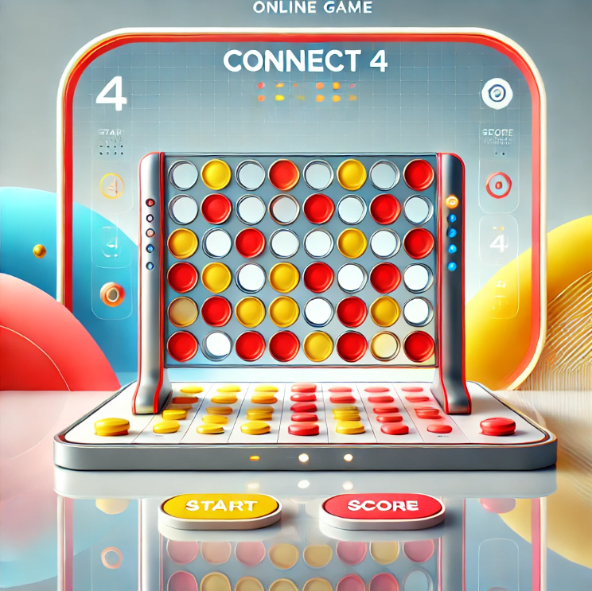

 # Connect 4 Game

A modern, web-based implementation of the classic Connect Four game with additional game modes and features. Play Connect-4, Connect-5, or Connect-6 with customizable settings!

  

----------

## Getting Started

### Play the Game

[Deployed Game Link](https://nayaba.github.io/spaceman/)

## 🎯 Game Modes

- **Connect-4**: Classic mode - Connect 4 chips to win
- **Connect-5**: Advanced mode - Connect 5 chips to win
- **Connect-6**: Expert mode - Connect 6 chips to win

## 🎲 Game Rules

### Basic Rules
1. Players take turns dropping colored chips into the grid
2. Chips fall to the lowest available position in the chosen column
3. First player to connect their required number of chips wins!
4. Connections can be made:
   - Horizontally ➡️
   - Vertically ⬆️
   - Diagonally ↗️↘️

### How to Play

1. Guess letters to complete the word before running out of attempts.
2. Each incorrect guess moves the spaceman closer to being lost in space.
3. Save the spaceman by correctly guessing the word!

### Special Rules & Features

#### Time Limit ⏱️
- Each player has 7 seconds amximum to make their move
- If time runs out, turn automatically switches to the other player

#### Grid Size Options 📐
Choose from multiple grid sizes:
- 7x6 (Classic)
- 7x7
- 8x7
- 8x8
- 9x7
- 9x8
- 9x9

#### Player Customization 👤
- Customize player names
- Player 1 uses red chips
- Player 2 uses yellow chips

## 🎮 How to Play 

1. **Setup Game**:
   - Enter player names
   - Select game mode (Connect-4/5/6)
   - Choose grid size
   - Click "Start Game"

2. **During Game**:
   - Click any column to drop your chip
   - Watch the timer - you have 7 seconds maximum per turn
   - Try to connect your chips while blocking your opponent

3. **Winning**:
   - Connect the required number of chips (4, 5, or 6)
   - Game ends when a player wins or the grid is full (tie)
   - Click "Play Again" to start a new game

### Planning Materials

[View Planning Documents](https://trello.com/b/S6mq9UyQ/connect-4-game)

----------

## Attributions

-   [Astronaut Image](https://www.vecteezy.com/vector-art/5429564-astronaut-spaceman-flying-hovering-black-and-white-hand-drawn-vector-illustration)
-   [Roboto Font](https://fonts.google.com/specimen/Roboto)
-   [Sound Effects](https://www.zapsplat.com/music/astronaut-breathing-in-helmet-space-mask-calm-could-be-scuba-diver/)

----------

## Technologies Used

  
  

----------

## Next Steps

- Add AI opponent with multiple difficulty levels
- Implement engaging sound effects for:
  - Chip drops
  - Winning combinations
  - Timer warnings
  - Background music
- Allow players to choose their chip colors
- Local storage for settings
- Create dark/light theme options

----------

# Enjoy playing Connect Game! 🎉
